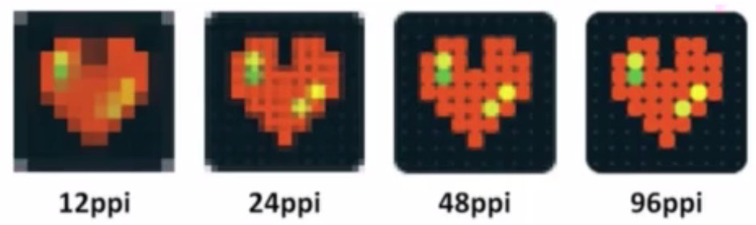

# rem自适应的原理

## 等比缩放原理

rem的本质是等比缩放，在不同设备下，ue图等比缩放。

假设我们将屏幕分为100份，每一份用x表示，x=屏幕宽度/100，x为屏幕宽度的1%。如果将x作为单位，x前面的数值就为占屏幕宽度的百分比

```
p{width: 50x;}/*屏幕宽度的50%*/
```

css中存在一个可动态设置的单位rem，使rem=屏幕宽度/100，这样我们就可以根据不同的屏幕宽度设置元素的宽度，屏幕宽度无论如何变化，元素永远都占屏幕宽度的50%了。

```
html{font-size: dWidth/100}
p{width: 50rem;}/*50rem=屏幕宽度的50%*/
```

在页面初始化和resize时，设置font-size，代码如下：

```
document.documentElement.style.fontSize = document.documentElement.clientWidth/100+'px'
```

## 如何设置css的值？

```
xrem=元素宽度/根元素font-size=元素宽度/(dWidth/100)=元素宽度/dWidth*100
```

在设计稿中表现为：


```
xrem=设计稿元素宽度/设计稿宽度*100
```

现在我们拿到一张设计稿，为640px，其中一个元素为100px，根据公式

```
设计稿元素宽度/设计稿宽度*100 = 100/640*100 = 15.625rem
```

设置后在不同设备下，ue图等比缩放


## 单位优化

每次去计算rem的值实在是太麻烦了，可不可以我在设计稿上量出多少，我就写多少呢？在less和sass中去定义一个自定义变量rpx使

```
xrem = yrpx = 设计稿元素宽度*rpx，
```

前面说过，假定将屏幕分为100份，1rem就为屏幕宽度的1%，则当设计稿元素宽度为100%时，元素为100rem，带入公式得

```
100rem=  设计稿元素宽度*rpx，
=>rpx = 100/设计稿元素宽度
```

假设现在我们拿到的设计稿是640px的，在less中代码如下

```
rpx: 100 / 640 * 1rem;
p{
    width: 320rpx;
}
```

## dpr

在js中，window.devicePixelRatio获取到当前设备的dpr。
那么在css中呢？可以通过-webkit-device-pixel-ratio，-webkit-min-device-pixel-ratio和 -webkit-max-device-pixel-ratio进行媒体查询，对不同dpr的设备，做一些样式适配(这里只针对webkit内核的浏览器和webview)。

物理像素，也称设备像素，设备独立像素，某个手机的固定像素，设备厂家做了多少显示图像的最小显示特定颜色的单位。
css像素，逻辑像素，是为web开发者创造的，在CSS和javascript中使用的一个抽象的层。
dpr，设备像素比:
```
设备像素比 ＝ 物理像素 / 设备独立像素

```





### 缩放

在不同的屏幕上，CSS像素所呈现的物理尺寸是一致的，而不同的是CSS像素所对应的物理像素是不一致的。在普通屏幕下1个CSS像素对应1个物理像素，而在Retina屏幕下，1个CSS像素对应的却是4个物理像素。（将一个750px的图片设置为375px，图片的渲染像素就是375css像素了，1个css像素仍旧占了4个物理像素，导致图片模糊）这样的显示，会导致retina屏幕下图片不清晰，那么我们可以这样做：
将css放大dpr倍，屏幕view-port缩放1/dpr倍。这样1个css像素就会对应1个物理像素，而清晰的显示图片了。


```
rem = rootWidth * dpr/100;
metaEl.setAttribute('content', 'initial-scale=' + scale + ',user-scalable=yes' + (needviewPortFit ? ', viewport-fit=cover':''));
```


### [data-dpr="2"]

如果不想全部缩放，而想单独设置某个元素1个css像素对应1个物理像素呢？

#### 第一种方式：

先在js中设置：
```
dpr = window.devicePixelRatio;
document.documentElement.setAttribute('data-dpr', dpr);
```

在css中:
```
//如果为less
.px2px(@name, @px){
    [data-dpr="2"] & {
        @name: @px * 1px;
    }
}
//普通css
[data-dpr="2"] .px2px{
    @name: @px * 1px;
}

```
#### 第二种方式

那么在css中呢？可以通过-webkit-device-pixel-ratio，-webkit-min-device-pixel-ratio和 -webkit-max-device-pixel-ratio进行媒体查询，对不同dpr的设备，做一些样式适配(这里只针对webkit内核的浏览器和webview)。

```

@media (-webkit-min-device-pixel-ratio: 2) { ... }
/* is equivalent to */
@media (min-resolution: 2dppx) { ... }

/* And likewise */
@media (-webkit-max-device-pixel-ratio: 2) { ... }
/* is equivalent to */
@media (max-resolution: 2dppx) { ... }

```

## 1px问题

设计小哥哥，小姐姐们对美有着极致的追求，为了满足他们，我们需要设置1物理像素的border，

如果前面有将css像素放大dpr倍后，又进行缩放，缩放后1个css像素覆盖1个物理像素，可以直接设置1px的css像素，显示的就是1px的设备像素，不存在解决1px问题。

但是对于老项目中呢，若想显示1px物理像素呢。采用transform: scale(0.5, 0.5);缩小一半的方式。

```
.border-scale(@color, @border-radius: 0px,
    @border-width: 1px 1px 1px 1px){
    &:after{
        content: " ";
        position: absolute;
        top: 0;
        left: 0;
        width: 200%;
        height: 200%;
        border: 1px solid @color;
        border-width: @border-width;
        border-radius: 2 * @border-radius;
        transform-origin: 0% 0%;
        -webkit-transform-origin: 0% 0%;
        -webkit-transform: scale(0.5, 0.5);
        transform: scale(0.5, 0.5);
        pointer-events: none;
        -webkit-box-sizing: border-box;
        box-sizing: border-box;
    }
}
```

## 安卓机型兼容问题

在三星Galaxy5和华为荣耀9中，发现端内h5容器内屏幕展示偏大，经过追踪，发现其中1rem!=root font-size
，（端内webview的1rem=1.233font-size）为了校正此问题，如果1rem 是font-size的n倍，则将font-size缩小n（n可以大于1，也可以小于1）倍。
那么怎么计算n值呢？我创建一个100rem的元素，计算他的offsetWidth，和用root font-size计算出来的宽度。
他们之间的比offsetWidth/root font-size计算出来的宽度就为n。将其缩小n倍，则解决了1rem!=root font-size的问题

具体代码如下

```
function remPatch(){
    var remTestFragment = document.createElement('div');
    remTestFragment.id = 'rem-test';
    remTestFragment.style.width = '100rem';
    remTestFragment.style.opacity = 0;
    remTestFragment.style.position = 'absolute';
    remTestFragment.style.top = '-1000px';
    remTestFragment.style.left = '-1000px';
    document.addEventListener('DOMContentLoaded', function(){
        document.body.appendChild(remTestFragment);
        var currentTestWidth = remTestFragment.offsetWidth;
        var rootFontSize = docEl.style.fontSize.replace(/px/, '') * 100;/*提高精度*/
        var scale = currentTestWidth / rootFontSize;
        rootFontSize = rootFontSize / 100 / scale;/*提高精度*/
        window.rootFontSize = rootFontSize;
        docEl.style.fontSize = rootFontSize + 'px';
        remTestFragment.parentNode.removeChild(remTestFragment);   
    });
}
```

### 参考链接：

> http://div.io/topic/1092

> https://juejin.im/entry/584e427361ff4b006cd22c7c

> https://github.com/amfe/article/issues/17

> https://github.com/amfe/lib-flexible

> https://www.w3cplus.com/css/towards-retina-web.html